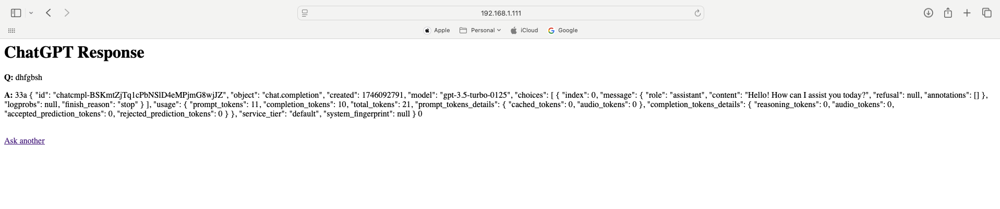

## 🚀 ESP8266 + ChatGPT Web Interface

This project lets you run a simple web server on an ESP8266 board (like NodeMCU or Wemos D1 Mini) to interact with **OpenAI's ChatGPT (gpt-3.5-turbo)** via a browser. It connects over Wi-Fi, sends a question to the OpenAI API, and displays the response in a web page.

### ✨ Features

- Web interface hosted by the ESP8266
- Sends user input to OpenAI's ChatGPT API
- Displays GPT-3.5-turbo responses in your browser
- Uses HTTPS (with `setInsecure()` workaround for SSL)

---

## 🧰 Requirements

- ESP8266 board (NodeMCU, Wemos D1 Mini, etc.)
- Arduino IDE
- Installed Libraries:
  - `ESP8266WiFi`
  - `ESP8266WebServer`
  - `WiFiClientSecure`
  - `ArduinoJson` (v6)

---

## 🛠 Setup Instructions

1. **Clone or Copy the Code**
   Save the sketch as `esp8266_chatgpt_web.ino`.

2. **Install Required Libraries**
   In Arduino IDE, go to:
   - **Sketch > Include Library > Manage Libraries**
   - Install `ArduinoJson` and ensure ESP8266 libraries are up to date.

3. **Configure Wi-Fi and API Key**
   Replace placeholders in the code:
   ```cpp
   const char* ssid = "YOUR_WIFI_SSID";
   const char* password = "YOUR_WIFI_PASSWORD";
   const char* apiKey = "sk-XXXXXXXXXXXXXXXXXXXXXXXXXXXX"; // OpenAI API Key
   ```

4. **Upload the Code**
   Select your board and COM port, then upload the sketch.

5. **Open Serial Monitor**
   - Baud rate: **115200**
   - Note the ESP8266’s IP address once connected.

6. **Open the Web Interface**
   Open your browser and visit the IP address shown in the Serial Monitor, e.g.:

   ```
   http://192.168.1.123
   ```

---

## 🌐 Example Use

1. Type a question in the input box (e.g., “What is the capital of France?”).
2. Click **Ask**.
3. ChatGPT will return the answer: “The capital of France is Paris.”

---

## ⚠️ Limitations & Notes

- `client.setInsecure()` is used to bypass SSL certificate checks — not recommended for production.
- Large or complex responses may fail due to limited RAM on the ESP8266.
- API requests may fail if your OpenAI key is invalid or exceeds quota.

---

## 📸 Screenshot

  
*Example UI hosted by ESP8266*

Video:
[Watch the demo video](https://youtu.be/ckJ2rb9kR80)

<video width="600" controls>
  <source src="esp_with_gpt_reduced.mp4" type="video/mp4">
  Your browser does not support the video tag.
</video>

